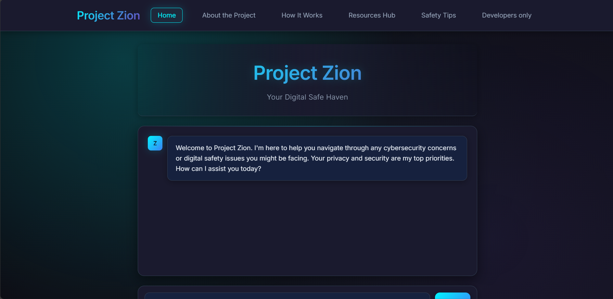
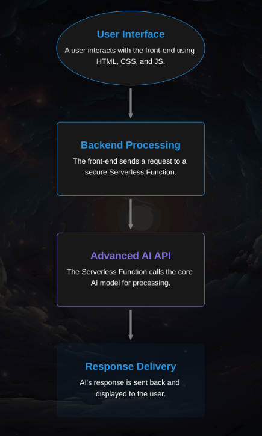

# Project Zion

## 🌐 Live Demo

**[Visit Project Zion →](https://project-zion.vercel.app/)**

Experience the live application deployed on Vercel. No installation required - just click and start using our digital sanctuary.

[](https://opensource.org/licenses/MIT)
[](https://github.com/CreeperBoy75/project-zion/)

> An anonymous, AI-powered sanctuary for victims of cybercrime.

**Project Zion** was developed for the **TENET'25 Hackathon** ("The Matrix" theme). It is a web-based, secure safe haven designed to provide immediate and empathetic support to individuals facing cyberbullying, online scams, and other forms of digital distress.

## 🌐 Live Demo

**[Visit Project Zion →](https://project-zion.netlify.app/)**

Experience the live application deployed on Netlify. No installation required - just click and start using our digital sanctuary.

---

## 🛡️ Why "Zion"? 

In the world of *The Matrix*, Zion is the last human city—a hidden, underground sanctuary where humanity is safe from a hostile, machine-controlled world. Our project draws a direct parallel to this: **Project Zion aims to be a digital sanctuary**, a secure and anonymous safe haven for individuals facing the hostile and often overwhelming threats of the online world.

We chose the name Zion because it represents more than just a place of passive safety; it represents a place of **resistance and empowerment**. This philosophy is at the core of our AI companion's design. It doesn't just offer comfort; it provides users with the actionable intelligence and clear guidance needed to "wake up" from the confusion of an attack, regain control, and fight back against digital threats.

Ultimately, Project Zion is a fortress of support, designed to help users find their strength in the face of digital adversity.

---

## 🚀 Quick Start

1. **Navigate to root folder:**
   ```bash
   cd project-zion
   ```

2. **Install dependencies:**
   ```bash
   npm install
   ```

3. **Set up environment:**
   ```bash
   cp .env.example .env
   # Add your Cohere API key to .env
   ```

4. **Run locally:**
   ```bash
   npm run dev
   ```

5. **Deploy to Vercel:**
   - Connect your GitHub repository to Vercel
   - Set root directory to `.` (repository root)
   - Set `COHERE_API_KEY` environment variable in Vercel dashboard
   - Deploy automatically on push!

## 🖼️ Screenshot / Demo



---

## 🌟 Key Features

* **Empathetic AI Companion:** At the core of the platform is "Zion," an AI powered by Cohere's advanced language models, trained to provide supportive, non-judgmental conversation.
* **Actionable Intelligence:** Zion offers clear, step-by-step guidance for various cybercrimes, helping users understand how to secure their accounts, report incidents, and mitigate damage.
* **Secure & Anonymous:** The platform is designed to be a true sanctuary, requiring no personal information to use, ensuring complete user anonymity.
* **Responsive UI:** A clean, modern, and calming user interface built with a "cyberpunk sanctuary" theme that is fully responsive for both desktop and mobile use.

## 💻 Technology Stack

The project leverages a modern, API-first architecture to deliver a powerful experience with a lightweight footprint.

* **Front-End:** `HTML5`, `CSS3`, `JavaScript`
* **Backend:** `Serverless Function` (Designed as a secure API proxy)
* **Core AI:** `Cohere AI API`
* **Version Control:** `Git` & `GitHub`

## 🏛️ System Architecture

Our project uses a modern, API-first architecture to ensure security and scalability. The data flow is illustrated below:



---

## 🚀 Getting Started

To run the prototype locally:

1. Clone this repository to your local machine.
2. Navigate to the root folder.
3. Follow the Quick Start instructions above.

### 🔧 Vercel Deployment

1. **Push to GitHub:**
   ```bash
   git add .
   git commit -m "Restructure for Vercel deployment"
   git push origin main
   ```

2. **Connect to Vercel:**
   - Go to [vercel.com](https://vercel.com)
   - Sign in with GitHub
   - Import your repository
   - **Important**: Set root directory to `.` (root) in Vercel project settings

3. **Environment Variables:**
   - In Vercel dashboard → Settings → Environment Variables
   - Add: `COHERE_API_KEY` with your Cohere API key

4. **Deploy:**
   - Click "Deploy" - Vercel will automatically deploy
   - Future commits to main branch will auto-deploy

## 🌱 Future Development

Our vision for Project Zion extends beyond this initial prototype. Future plans include:

* **Mobile Application:** Native iOS and Android apps for on-the-go support.
* **Verified Human Support:** An optional, secure channel to connect users with certified therapists and cybersecurity professionals.
* **Advanced Analytics:** An anonymized system to identify emerging cybercrime trends to proactively protect the community.
* **Encrypted Peer Support:** A heavily moderated, anonymous community forum for survivors to share experiences.

## 📄 License

This project is licensed under the **MIT License**. See the `LICENSE` file in this repository for details.

## 👥 The Team (Team Sci-craft)

* Neeraj Kudale
* Hruday Bothra
* Abhiram Dighe
* Kshitij Sonavane